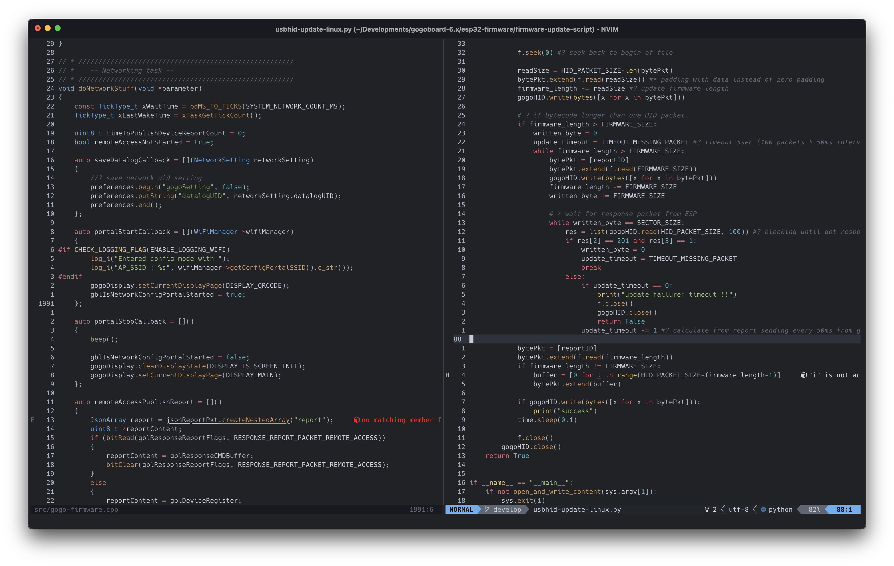

# Plastic Neovim Theme

An Atom One inspired dark and light colorscheme for neovim. Plugin modeled after [highlite.vim](https://github.com/Iron-E/nvim-highlite/blob/master/colors/highlite.vim) and [one-nvim](https://github.com/Th3Whit3Wolf/one-nvim)

This fork modified from `one-nvim` to [Plastic](https://plastictheme.com/palette) colorscheme
- Colors are almost the same, mainly focus on [Plastic Legacy v2](https://github.com/hadialqattan/plastic-legacy) theme
- Lualine colorscheme added

## Screenshots


*Font:* [Hack NF](https://github.com/ryanoasis/nerd-fonts/releases/latest) | 
*Lualine:* [Lualine](https://github.com/nvim-lualine/lualine.nvim) | 
*RGB Highlightin:* [nvim-colorizer](https://github.com/norcalli/nvim-colorizer.lua)

## Prerequisites

1. Neovim 0.5+

### Installation

#### Vim Plug

```vim
Plug 'MomePP/plastic-nvim'

" And then somewhere in your init.vim, to set the colorscheme
colorscheme plastic-nvim
```

#### Minpac

```vim
call minpac#add('MomePP/plastic-nvim')

" And then somewhere in your init.vim, to set the colorscheme
colorscheme plastic-nvim
```

#### Vim Packages

In the terminal execute this command.

```sh
cd ~/.local/share/nvim/site/pack/opt/
git clone https://github.com/MomePP/plastic-nvim
```

In your `init.vim` add the following

```vim
packadd! plastic-nvim
```

```vim
colorscheme plastic-nvim
```

```vim
vim.cmd 'colorscheme plastic-nvim'
```

### Transparent background
###### Require terminal with transparent background and must set before calls `colorscheme` 

```lua
vim.g.plastic_nvim_transparent_bg = true
```

### Lualine colorscheme setup

```lua
lualine.setup {
    options = { theme = require('lualine.plastic') }
}
```

### NOTE

- Vim is not supported because the theme is written in lua.
- If you feel like a language should be highlighted differently please open an issue.
